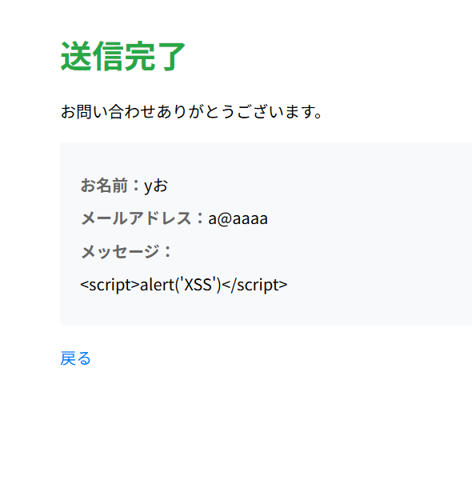

## 概要

COACHTECH 教材 Tutorial 10-6「Webセキュリティ ハンズオン」で作成した成果物です。
セキュリティ対策ありの登録サイト作り

## 使用技術

- PHP 8.x
- Laravel 10.x
- CSRF 保護（`@csrf`）、XSS 対策（Blade の自動エスケープ）
  （**他に使ったものがあれば追記してください**）

## 学んだこと

- 419ページ画面が出るのを見た
  -@csrfの有無で、表示がかわること -{{}}で囲むことでスクリプト動かないようになる

## 動作確認

http://localhost/contactで正しく登録画面がでる
ビューから@csrfを削除して送信すると419 Page Expiredエラーになる
メッセージに「」入れて送信しても文字ベース表示がでるだけで画像でない
